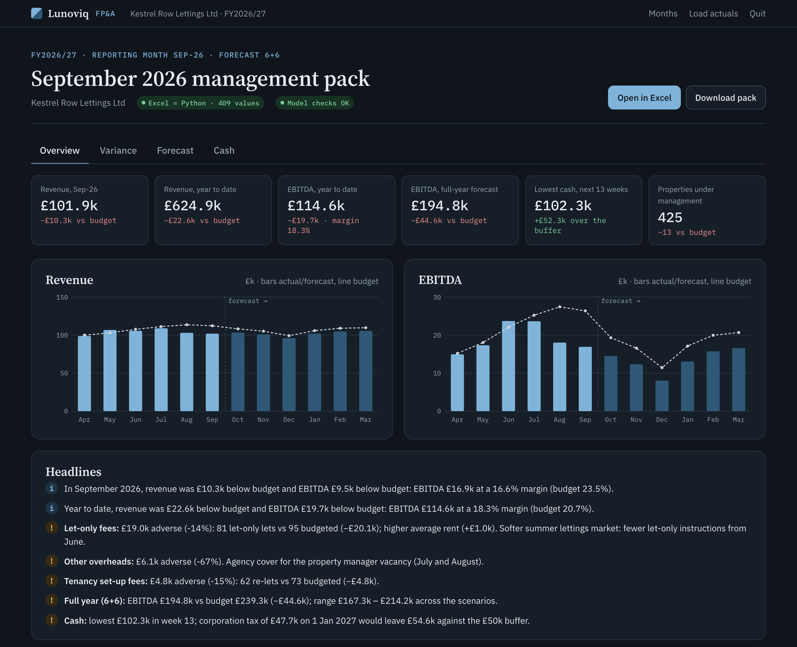
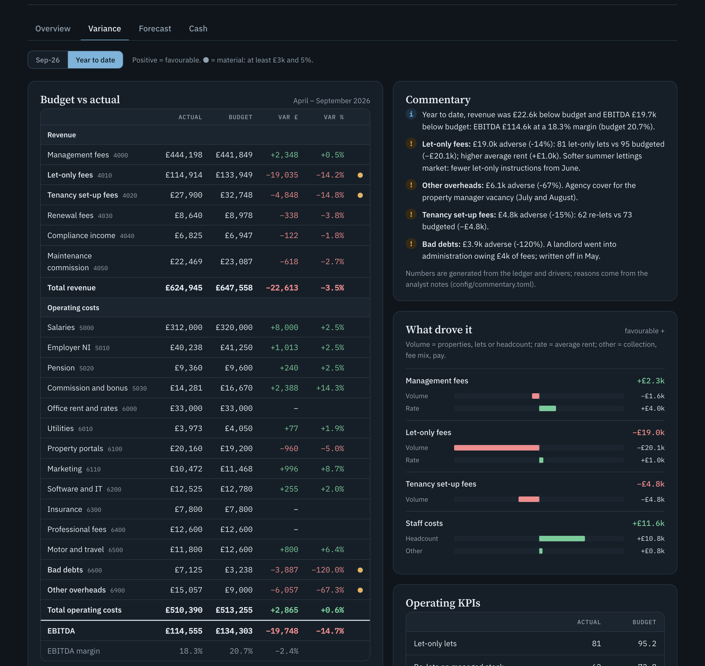
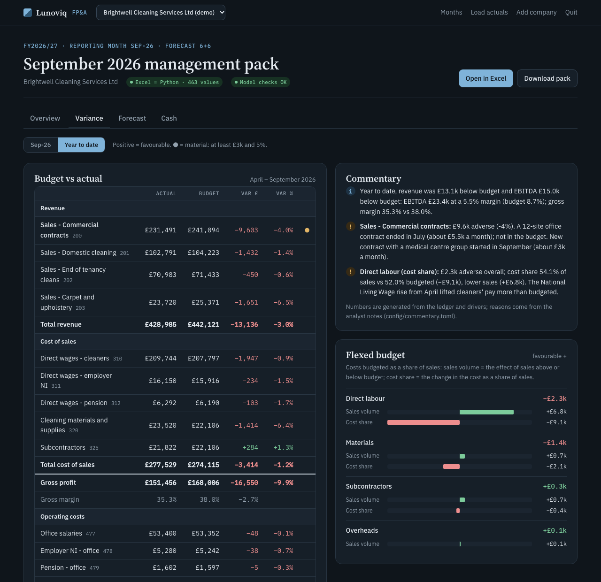
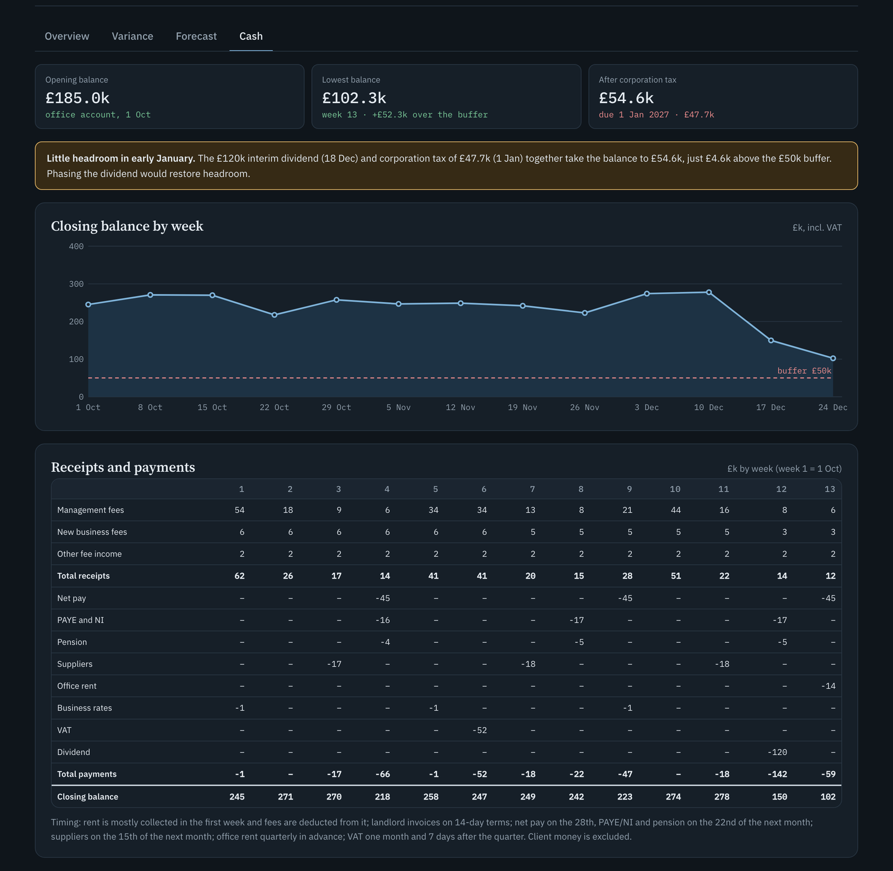
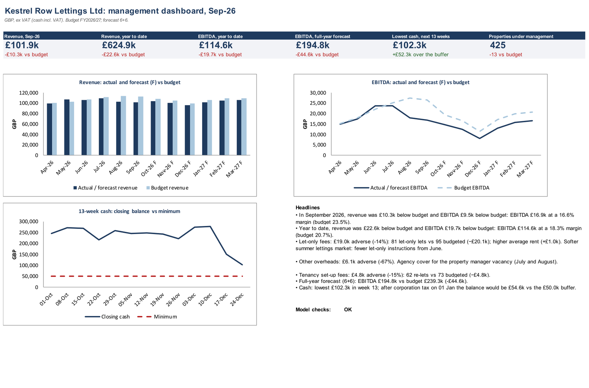

# Lunoviq FP&A: budgeting, forecasting and management reporting

An FP&A system built the way a finance team works month to month. It covers:

- a driver-based budget,
- actuals loaded from the ledger,
- budget vs actual analysis with driver bridges and commentary,
- a rolling forecast with scenarios,
- a 13-week cash flow,
- a board-ready management pack.

The pack is an Excel workbook with live formulas. It is recalculated in Excel and then audited against an independent Python engine.

```
python -m fpa run --month 2026-09
```

```
.. actuals
.. workbook
.. recalc
.. audit
Pack: output/2026-09_…/Kestrel_Row_Lettings_FPA_2026-09.xlsx
YTD revenue 624945 vs 647558 budget; EBITDA 114555 vs 134303
Full-year EBITDA (6+6): 194752 vs budget 239320
Audit: 409 values checked, 0 mismatches, 0 Excel errors; model checks OK
```



**It works for any company.** Upload last year's P&L by month from Xero, QuickBooks, Sage or another system. The wizard suggests how each account maps into the management P&L; you confirm it; and from then on each month's trial balance export produces the pack. Two fictional demo companies are included:

| Demo company | Budget | Data |
|---|---|---|
| **Kestrel Row Lettings Ltd**: letting agent, ~420 managed properties, £1.3m revenue | Driver-based (properties, rent, lets, headcount) | Seeded simulator |
| **Brightwell Cleaning Services Ltd**: commercial and domestic cleaning, £0.85m revenue | Rule-based from last year's actuals (growth, % of sales, fixed) | Xero-style exports (P&L by month, year-to-date trial balances with the balance sheet) imported through the importer |

All data is synthetic and reproducible. See [the design notes](docs/DESIGN.md).

## What it does

| Step | What happens | Where |
|---|---|---|
| **Budget** | Driver-based FY2026/27 budget (see below). | `config/company.toml` → Assumptions, Drivers, Budget sheets |
| **Actuals** | Monthly trial balance and KPI exports are validated (accounts, period, duplicates, completeness) and loaded. | `data/actuals/<month>/`, web upload |
| **Budget vs actual** | Month and year to date by account; materiality flags (£ **and** %); driver bridges; commentary. | BvA sheet, Variance tab |
| **Rolling forecast** | 6+6 reforecast: actuals for closed months, then the driver engine from the actual closing position, updated by a latest estimate. | Forecast sheet, `config/forecast.toml` |
| **Scenarios** | Upside and downside on lettings volume, churn, new landlords and rent growth. | Scenarios sheet |
| **13-week cash** | Weekly office-account cash flow with UK timing rules. | Cash13W sheet, Cash tab |
| **Management pack** | Cover, dashboard with KPI tiles, charts and headlines, and a Checks sheet with sheet-to-sheet reconciliations. | Excel pack, web panel |

**Budget drivers:**
- properties under management (gained and churned, with seasonality),
- average rent and rent growth,
- management fee %,
- let-only and re-let activity, renewals, certificates, maintenance commission,
- headcount by role (with the planned hire),
- employer NI and pension,
- cost drivers.

**Driver bridges** split each variance into its causes:
- management fees: portfolio size (volume) vs average rent (rate);
- let-only fees: lets vs rent;
- set-up fees: re-lets;
- staff costs: headcount vs pay.

**Commentary** combines two sources: text generated from the numbers, and analyst notes for the business reasons (`config/commentary.toml`).

**Cash timing rules:**
- VAT is collected on fees and paid one month and seven days after the quarter.
- Net pay goes out on the 28th; PAYE/NI and pension on the 22nd of the following month.
- Suppliers are paid on 30-day terms.
- Office rent is paid quarterly in advance on the English quarter days.
- Landlord invoices are on 14-day terms.
- The planned dividend is included.
- Corporation tax is flagged when it falls just outside the window.



## Any company: importer and rule-based budget

- **Importer** (`fpa/importer.py`). It reads trial balances (debit/credit or signed balance, monthly or year to date) and P&L-by-month reports as accounting systems export them:
  - title lines above the table,
  - codes or names only,
  - comma, semicolon or tab delimiters,
  - `£1,234.56` and `(1,234.56)`,
  - section headings and subtotals.

  Nothing is stored unless every account is in the chart and the P&L reconciles to the file to the penny.
- **Rule-based budget** (`fpa/rules.py`). Each account uses one rule:
  - growth on last year's month (keeps seasonality),
  - % of sales,
  - fixed,
  - prior year,
  - manual,
  - tax on profit.

  The Excel Budget sheet carries the rules as live formulas.
- **Flexed budget.** For costs budgeted as a share of sales, the variance is split into sales volume and cost share. For Brightwell this finds that cleaners' pay rose to 54.1% of sales against 52.0% budgeted (−£9.1k), which the drop in sales (+£6.8k) had largely hidden.



## The September 2026 story (synthetic)

The simulated first half of FY2026/27 contains events that the analysis has to find and explain:

| Event | Effect found by the model |
|---|---|
| Softer summer lettings market (−12%) | Let-only fees −£19.0k YTD: 81 lets vs 95 budgeted |
| A portfolio landlord leaves with 24 properties (July) | Portfolio 425 vs 438 budgeted; volume effect on management fees |
| Rents rise faster than budget (0.6% vs 0.4% a month) | +£4.0k rate effect on management fees |
| A property manager resigns; agency cover (June–August) | Staff +£11.6k (headcount), other overheads −£6.1k |
| A landlord goes into administration owing fees | Bad debts −£3.9k |
| Property portal price rise of 15% (August) | Carried into the forecast |

**The results:**
- **Year to date:** EBITDA is £114.6k against £134.3k budgeted.
- **Full-year forecast (6+6):** EBITDA of £194.8k against £239.3k budgeted, with a range of £167k–£214k across the scenarios.
- **Cash:** after the £120k interim dividend and the 1 January corporation tax payment, headroom over the £50k buffer falls to about £5k. This is the point to take to the board.



## The Excel pack

The pack has eleven sheets: Cover, Dashboard, BvA, Forecast, Scenarios, Cash13W, Actuals, Budget, Drivers, Assumptions and Checks.

- **Built by code.** Every budget and variance figure is a formula. Inputs are blue named ranges, and months run across the columns.
- **Recalculated in Microsoft Excel.** Recalculation runs in the background through xlwings, on a copy inside Excel's sandbox, with a timeout.
- **Audited.** After recalculation, 409 values (budget, variance, forecast, cash) are compared with the Python engine. The Checks sheet must report OK.



## Quick start

```bash
pip install -r requirements.txt
python -m fpa run --month 2026-09        # build, recalculate and audit the September pack (Kestrel Row)
python -m fpa run --company brightwell-cleaning --month 2026-09
python -m fpa serve                      # web panel at http://127.0.0.1:8766
python -m fpa simulate                   # regenerate the synthetic actuals
```

**Monthly workflow in the web panel:**
1. **Load actuals.** Upload the month's trial balance export (Kestrel: trial balance and KPI files). Sample October files can be downloaded from the upload page.
2. **Build the pack.**
3. **Review** the Overview, Variance, Forecast and Cash tabs.
4. **Open or download** the Excel pack.

Recalculation needs Microsoft Excel (macOS or Windows). Without it, use `--no-recalc`: the workbook recalculates when it is opened in Excel.

## Tests

```bash
python -m pytest                     # fast (56 tests)
RUN_EXCEL_TESTS=1 python -m pytest   # adds the Excel recalculation and audit tests
```

The tests cover:
- the calendar and chart of accounts;
- the driver engine and ledger validation;
- that the simulated events are reproducible;
- the budget, BvA, forecast and cash sheets matching Python after recalculation in Excel;
- variance signs and bridge arithmetic;
- forecast and scenario ordering;
- the cash timing rules;
- the pipeline audit;
- the web API (uploads, validation, jobs, downloads, path safety).

## Repository layout

```
fpa/
  company.py     company workspaces and financial-year calendar
  accounts.py    chart of accounts (sections, lines, cash classes) and P&L subtotals
  importer.py    accounting-system exports -> stored monthly actuals
  onboard.py     add a company from its P&L by month (web wizard)
  rules.py       rule-based budget and run-rate forecast (any company)
  demo_brightwell.py  Xero-style demo exports for Brightwell Cleaning
  drivers.py     driver engine shared by budget, forecast and simulator
  ledger.py      trial balance / KPI exports: read, validate, write
  simulate.py    synthetic actuals with business events (seeded)
  budget.py      driver-based budget (Python mirror of the Budget sheet)
  variance.py    budget vs actual, bridges, flags, commentary
  forecast.py    rolling forecast and scenarios
  cash.py        13-week cash flow
  workbook.py    builds the Excel pack with live formulas
  recalc.py      Excel recalculation (sandbox-safe, timeout)
  pipeline.py    monthly run: build, recalculate, audit, summary.json
  web/           local web panel (server.py + static/)
companies/       one folder per company: company.toml, accounts.csv, forecast.toml,
                 commentary.toml, actuals/ (and imports/ for Brightwell's raw exports)
tests/           pytest suite
docs/            design notes, change log, screenshots
```

## Limitations

- The data is synthetic. Actuals arrive as P&L trial-balance movements and KPIs; there is no balance-sheet ledger, so the cash flow is derived from the P&L with timing rules.
- Headcount by role for the forecast follows the budget plan (the KPI export has total headcount only).
- Recalculation needs Microsoft Excel.

## License

Copyright (c) 2026 Tolga Oy. All rights reserved. The code is published for
viewing only; see [LICENSE](LICENSE).
